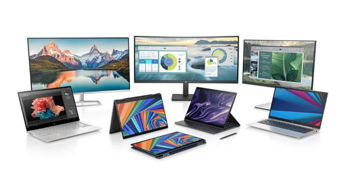

# TechNews
Este es un proyecto de ESPE
<?php
include 'global/config.php';
include 'global/conexion.php';
?>
<?php 
$tituloPagina = "Inicio Noticias";
$pagina = "inicio";
include('inc/header.php'); 
?> 

    <!-- SHOWCASE -->
    <header class="showcase">
      <h2>NUEVAS NOTICIAS TODOS LOS DÍAS</h2>
      
Las últimas noticias de tecnologías las podrás encontrar soló aquí

      <a href="based/registro.php" class="btn">
        REGISTRARSE <i class="fas fa-chevron-right"></i>
      </a>
    </header>

    <!-- NEWS CARDS -->
    
    

      

        
        
        <h3>Ofrecen 40 becas de sostenimiento para que mujeres estudíen programación en Holberton Colombia </h3>
        

        
Son 40 las becas de sostenimiento que se están ofreciendo a las mujeres de todo el país que deseen estudiar programación. La Fundación Fondo Social ANDI, Fundación WWB y Fundación Coderise se unieron para que más mujeres puedan formarse como programadoras en Holberton School Colombia. Son 30 becas para mujeres en Antioquia, 7 para mujeres en Cali y 3 más para mujeres en todo el país que apliquen a los campus de Holberton.
        

        

       
      

      

        
        <h3>Komercia, la startup latina que ayuda a cientos de empresarios a vender por Internet.</h3>
        

        
Tras dos años en el mercado, Komercia se ha consolidado como una startup de potencia global que permite a los pequeños y medianos empresarios mejorar las ventas de su negocio y lograr una mayor productividad. Esto lo ha hecho posibilitando el acceso a poderosas herramientas e-commerce y fintech, para la administración del inventario, la base de datos de los clientes y la gestión de ventas por múltiples canales, todo a través de su propio celular o computador.
        

        

        
      

      

        
        

        <h3>El emprendedor que impulsa el Marketing Digital con fichas de Lego</h3>
        
Una de las metodologías más innovadoras para la resolución de problemas en organizaciones y equipos llega a Colombia para aprender jugando cómo desarrollar exitosamente una estrategia de marketing digital 360º. Se trata de Lego Serious Play, una poderosa herramienta que utiliza las populares fichas o bloques de construcción de Lego para mejorar la innovación y el rendimiento empresarial.
          David Rodríguez Pinto, a través MDA Latam University, la primera universidad en América Latina enfocada en herramientas digitales.
        

        

       
      

      

        
        

        <h3>Qué es Signal, el servicio de mensajería "secreto" en el que el inventor de WhatsApp invirtió millones</h3>
        
Frente a la nueva Política de Privacidad de WhatsApp millones de usuarios están buscando alternativas a la aplicación de mensajería perteneciente a Facebook y un nombre resalta: Signal. A nivel mundial, la aplicación Signal fue descargada 8.8 millones en la última semana. "Signal se enfoca en la privacidad, pero con todas las características que esperas de una aplicación de chat", así se presenta el proyecto colaborativo.  
        

        

       
      

    

    <section class="cards-banner-one">
      

        <h2>WhatsApp vs Telegram: ¿cuál es la mejor aplicación de mensajería?</h2>
        

        
 Ambas aplicaciones se actualizan con frecuencia con novedades, de modo que es difícil mantenerse al día de qué ofrece cada una.
          Aquí tienes el duelo a fondo y actualizado de WhatsApp versus Telegram en conceptos como número de usuarios, privacidad, funciones disponibles y personalización. 
 

         

      

    </section>

    

      

        
        <h3>EE.UU. los prohibió pero en Argentina la rompe: cómo comprar los mejores celulares chinos que existen</h3>
        

        
El crecimiento exponencial del uso de dispositivos tecnológicos no se detiene, como así tampoco la venta de smartphones. En ese contexto, la firma china Xiaomi experimentó un salto en sus ventas del 75% en el tercer trimestre de 2020 en comparación con el mismo período del año pasado y le permitió superar, por primera vez, a Apple, según datos de la consultora IDC. Hoy, es el tercer fabricante de teléfonos en el mundo.
        
 

        
      

      

        
        <h3>Resumen anual de Google Maps: cómo mirar todos los (pocos) lugares que recorriste durante 2020</h3>
        

        
Ya se encuentra disponible el resumen anual de Google Maps que te cuenta qué hiciste y por dónde anduviste, esta función que recopila datos de ubicación para realizar un informe interactivo al estilo del famoso Spotify Wrapped se basa en una función que todas las cuentas de Google tienen activadas por defecto: el historial de ubicaciones.
          Este historial registra constantemente la ubicación y hace un seguimiento de todos los lugares visitados y los caminos tomados para llegar a ellos. 
        

       
      

      

        
        <h3>CES 2021: las empresas presentaron TV 8K, PC gamer y celulares plegables con precios "imposibles"</h3>
        

        
LEl evento anual de tecnología CES 2021 festeja su 51° edición. Empresas como LG, AMD, Sony, Panasonic, ASUS Republic of Gamers (ROG), Samsung, TCL y HP presentaron nuevos gadgets que llegarán al mercado este año. Estos son los mejores televisores 8K, monitores ultra delgados, computadoras gamer y celulares enrollables de la feria.
        

       
      

      

        
        <h3>Nueva estafa masiva en la red social en la que estan todos: cómo evitar que roben todos los datos bancarios</h3>
        

        
Haciéndose pasar por empleados del centro de ayuda, los ciberdelincuentes se hacen de datos personales para luego venderlos en la darkweb a sitios de ecommerce fraudulentos que comercializan registros sensibles.

          El comienzo de 2021 trajo consigo una intensa campaña que supo reciclar una estafa ya identificada el año pasado y afecta día a día a numerosos usuarios desprevenidos, víctimas de lo que se denomina el "copyright infringement".
        

       
      

    

    <section class="cards-banner-two">
      

        <h2>Sale 5 sueldos, pero se agotó 3 horas: cuál es la obsesión argentina por la Play 5</h2>
        

        
Este 19 de noviembre en punto desde las 12.00 se abrió una nueva reserva de la PS5 con lector de disco y la versión digital, tras agotarse el primer stock pre vendido el 29 de septiembre, mismo que se entregará este 4 de diciembre. La entrega de la segunda ronda de preventas esta programada para el 16 de diciembre. 

         

       
      

    </section>

      

        <h3>Comentarios</h3>
            <form action="" id="formularioComentarios" method="post">
                
<label>Nombre y apellido:</label>
            
                
<input type="text" placeholder="Escribe tus nombres" id="name" name="name">

    
    
                
<label>Correo electrónico:</label>

                
<input type="email" placeholder="Escribe tu correo electrónico" id="email" name="email">

    
                
<label>Comentario:</label>

                
<textarea placeholder="Escriba su comentario" id="coment" name="mensaje"></textarea>

    
    
                
<input class="btn" type="submit" name="comentar" value="Enviar" width= "200">

            </form>
             
          <?php 
          include("comen/comentar.php");
          ?>
      

    <?php include('inc/footer.php'); ?>
